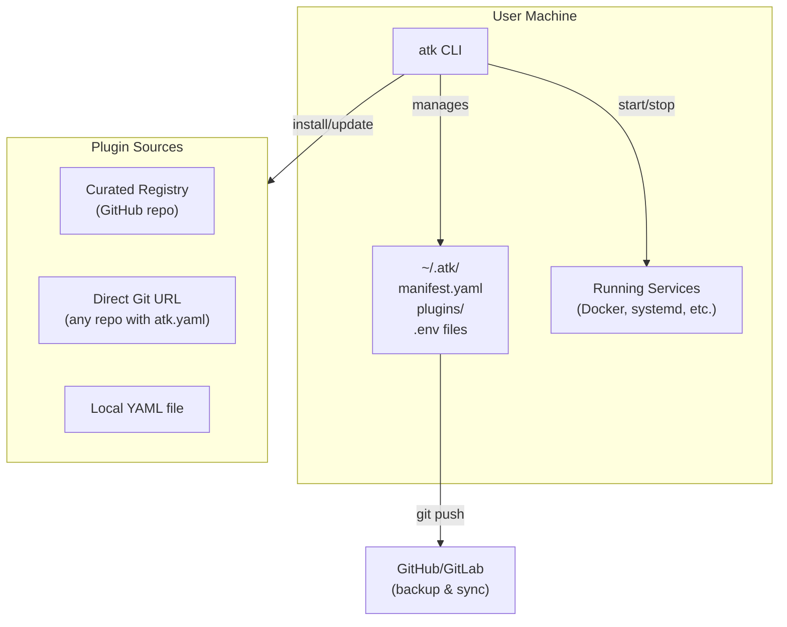

# ATK: Agent Toolkit Specification

> **Status**: Draft
> **Last Updated**: 2026-01-22

## Problem

Managing AI development tools is fragmented:
- Each tool has its own installation method (Docker, npm, pip, binary)
- Configuration scattered across different locations
- No unified way to version, backup, or sync setups across machines
- Setting up a new machine means hours of manual work

## Vision

A CLI tool that manages AI development tools through a **git-backed, declarative manifest**. Install once, sync everywhere.

```
atk install openmemory    # Add to manifest, install, commit
atk apply                 # Ensure all plugins match manifest
git push                  # Backup/sync to remote
```

## Tenets

| Tenet | Meaning |
|-------|---------|
| **Usability first** | If it's not easy to use, it's not useful |
| **AI agent first-class citizen** | CLI-driven, scriptable, agent-friendly; TUI is optional |
| **Sensible defaults, configurable** | Works out of the box; power users can customize |
| **Declarative** | Manifest describes desired state; tool enforces it |
| **Idempotent** | Running the same command twice = same result |
| **Git-native** | Every change is a commit; rollback = git revert |
| **Transparent** | All config is human-readable YAML; no hidden state |
| **Focused** | Manages tools, not builds them; delegates to Docker/systemd |
| **Test-driven** | Every feature starts with a test; everything automatable is automated |

## Architecture



### Manifest Directory Structure

```
~/.atk/                           # User-chosen directory
├── .git/                         # Initialized on first run
├── manifest.yaml                 # Installed plugins + versions
├── plugins/
│   ├── openmemory/
│   │   ├── plugin.yaml           # Plugin definition
│   │   ├── docker-compose.yml    # Service config (if applicable)
│   │   └── .env                  # Secrets (gitignored)
│   └── langfuse/
│       └── ...
└── .gitignore                    # *.env, vendor/, etc.
```

### Plugin YAML Schema

Uses date-based versioning (AWS-style): `YYYY-MM-DD`

```yaml
schema_version: "2026-01-22"
name: OpenMemory
description: Persistent memory layer for AI agents

# How to run the service
service:
  type: docker-compose          # docker-compose | docker | systemd | script
  compose_file: docker-compose.yml

# Optional: clone from upstream
vendor:
  url: https://github.com/CaviraOSS/OpenMemory.git
  ref: v1.2.3                   # tag, branch, or commit

# Network ports
ports:
  - name: API
    port: 8787
    configurable: true          # Can be changed during install
    health_endpoint: /health

# Environment variables
env_vars:
  - name: OPENAI_API_KEY
    required: false
    secret: true
    description: OpenAI API key for embeddings

# Lifecycle commands (sensible defaults if omitted)
lifecycle:
  install: ./install.sh         # Default: docker compose pull
  start: docker compose up -d   # Default: docker compose up -d
  stop: docker compose down     # Default: docker compose down
  logs: docker compose logs     # Default: docker compose logs
  status: ...                   # Default: check container status
  # Future: backup, restore, upgrade

# Optional: MCP integration
mcp:
  enabled: true
  type: http-proxy              # http-proxy | stdio | binary
  endpoint: http://localhost:${API_PORT}/mcp
```

Full schema reference: see `docs/plugin-schema.md` (TODO)

## CLI Commands

```bash
atk init [directory]       # Initialize manifest directory
atk install <plugin>       # Install from registry, URL, or local file
atk remove <plugin>        # Remove plugin
atk update [plugin]        # Update one or all plugins
atk apply                  # Ensure running state matches manifest
atk start <plugin>         # Start a plugin's service
atk stop <plugin>          # Stop a plugin's service
atk status                 # Show all plugins and their status
atk logs <plugin>          # View plugin logs
atk mcp <plugin>           # Show MCP config for IDE integration
atk                        # Launch interactive TUI (optional)
```

All commands return structured output suitable for AI agent consumption.

## Plugin Sources

| Source | Example | Use Case |
|--------|---------|----------|
| **Registry** | `atk install openmemory` | Curated, tested plugins |
| **Git URL** | `atk install github.com/org/repo` | Any repo with `atk.yaml` |
| **Local** | `atk install ./my-plugin.yaml` | Custom/private plugins |

Registry: `atk-registry` repo (same org), community contributions welcome (Homebrew model).

## Concerns & Mitigations

| Concern | Mitigation |
|---------|------------|
| **Security: arbitrary code execution** | Plugins run shell scripts (like brew, npm). Mitigated by: pinned versions, curated registry, clear warnings, git history for audit. User responsibility for untrusted sources. |
| **Adoption: why would projects add atk.yaml?** | They won't initially. Curated registry maintains YAMLs for popular tools. Users can contribute or roll their own. Low barrier (one YAML file). |
| **Version compatibility** | Schema version in YAML. CLI handles migrations. Breaking changes = major version bump. |
| **Cross-platform** | macOS/Linux first. Windows via community contribution. |
| **Drift: upstream changes break plugins** | Pinned versions by default. Update is explicit. Hash of working version stored for rollback. |
| **Port conflicts** | Configurable ports in schema. Install wizard detects conflicts. |

## Scope

### In Scope
- Plugin installation, update, removal
- Service lifecycle (start/stop/restart/logs)
- Configuration management (.env files)
- Git-backed manifest with auto-commit
- MCP config generation for IDE integration
- Interactive TUI and CLI commands
- Curated plugin registry (separate repo)

### Out of Scope
- Building MCP servers (we manage, not build)
- Dependency resolution between plugins
- Windows support (initially)
- Cloud deployment / remote management
- Plugin marketplace / discovery UI
- Automatic security scanning

## Decisions

| Question | Decision |
|----------|----------|
| **Naming** | `atk` (pronounced "atik") — short, no AI hype |
| **Distribution** | PyPI (`uv tool install atk` or `pip install atk`). Name verified available. |
| **Registry repo** | `atk-registry`, same org |
| **First-run wizard** | `atk init` creates empty local registry (git repo, no upstream). Option to clone existing registry for multi-machine sync. Optional starter pack prompt. |
| **Data backup** | Deferred. Schema is additive; will add `data:` section later. |

## Next Steps

See `docs/atk-roadmap.md` for implementation plan.

